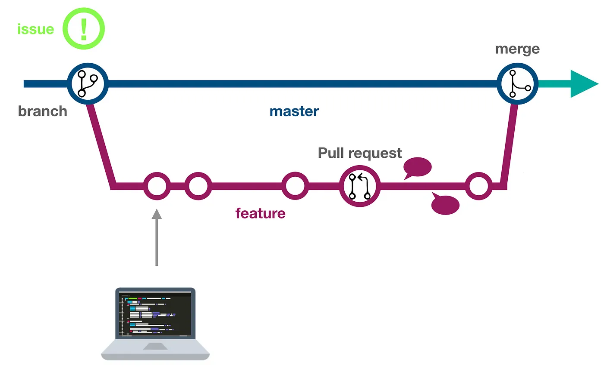

Developer's Guide
=================

Getting started
---------------

1. If you are a core developer on the Seshat project, ensure you are a maintainer of the Seshat repository, found at `Seshat-Global-History-Databank/seshat <https://github.com/Seshat-Global-History-Databank/seshat>`_.

    - Ask an existing maintainer to add you if you are not already a maintainer.
    - If you are not a core developer, you can still contribute by forking the repository and submitting pull requests from there.

2. Follow the instructions in the `Setting up Seshat in a local environment <../getting-started/setup/local/index.rst>`_ guide to set up your local development environment.

Development workflow
--------------------

1. Select an issue to work on from the `Seshat GitHub issues <https://github.com/Seshat-Global-History-Databank/seshat/issues>`_ to work on, or create a new issue. There are issue templates set up for:

    - Bug reports
    - Feature requests
    - Documentation improvements

2. Create a new branch from the `dev` branch.

    - Ensure you have run `git pull` to get the latest changes from the `dev` branch.

3. Implement your code changes.

    - Commit each change with a descriptive commit message.
    - Add tests if appropriate.
    - [Optional] You can run tests locally to ensure your changes do not break existing functionality. See the `Testing <../contribute/testing.rst>`_ guide for more information. Tests will also be run automatically on GitHub actions when you open a pull request.

4. Open a pull request on GitHub.

    - Push your branch to the remote repository.
    - Open the pull request from the new branch to the `dev` branch.
    - Assign the pull request to maintainer(s) for review.

9. Review and address any feedback on your pull request.

    - Make changes to your code based on the feedback, adding new commits to the branch and pushing them to the remote repository.
    - Once the feedback is addressed, request a review from the maintainer(s) again.

10. Once your pull request is approved, it can be merged into the `dev` branch.

11. Pull the latest changes from the `dev` branch to any remote servers running the Seshat application.

    - **TODO:** *add link to unwritten production deployment guide*
    - Ensure any new migrations added in the pull request are applied to the database. **TODO:** *add link to another page with Django notes*

Image taken from `The GitHub Flow <https://guides.github.com/introduction/flow/>`_ by Dev Genius